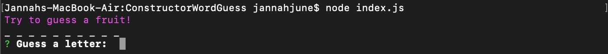
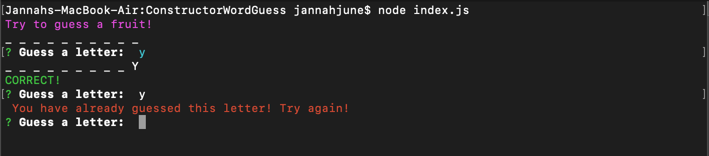
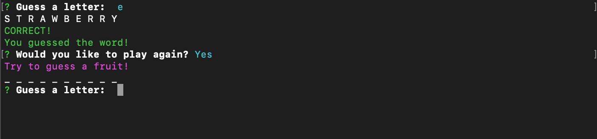
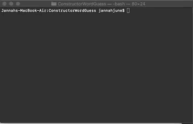

# ConstructorWordGuess

## Overview
A commmand-line word guessing game using constructor functions 

## Instructions
* Navigate to the root folder of the game
* Enter `node index.js` to start the game
* The terminal will then display a number of underscores to represet how many letters are in the mystery word
    * Hint: they're all fruits!
* It will then prompt you to "Guess a letter:" 

* You can only enter one letter at a time. Keep in mind, the game will stop you from entering letters that have already been guessed.

* You have 10 incorrect guesses before the game's over! No worries, the game will let you know if a guess was incorrect.

* Whether you guessed the word correctly or you've ran out of guesses, the game will ask if you'd like to play again
* If you'd like to play again, the game will choose a new word 

## Link
[Link to the Live Site](https://jnieves14.github.io/ConstructorWordGuess/)

It's a command line game, so opening the live site won't show much. >.<

## Preview

## Technologies Used
* Node.js
* javascript
* [Inquirer](https://www.npmjs.com/package/inquirer)
* [Colors](https://www.npmjs.com/package/colors)